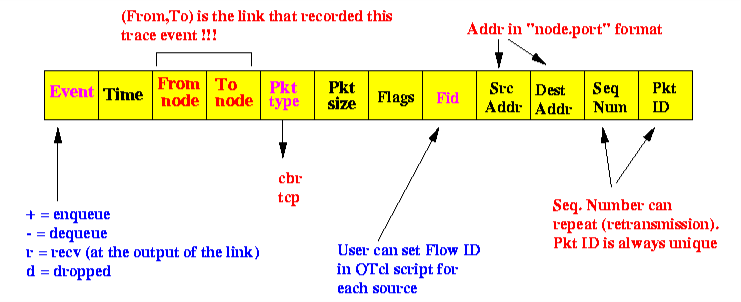

# NP-Lab
This repository contains programs implemented in Network Programing Lab in my 7th semester of SIT(VTU).


### Part A
1. For the given network graph, write a program to implement Link state routing algorithm to build a routing table for the given node.

2. Write a program to divide the message into variable length frames and sort them and display the message at the receiving side.

3. Using TCP/IP sockets, write a client – server program, the client sends the file name and the server sends back the requested text file if present.

4. Using FIFOs as IPC channels, write a client – server program, the client sends the file name and the server sends back the requested text file if present.

5. Using UDP, write a client – server program, to exchange messages between client and the server.

6. Write a socket program to demonstrate IP multicasting which provides the capability for an application to send a single IP datagram that a group of hosts in a network can receive.

7. Write a program to implement sliding window protocol between two hosts.

8. Write a program for error detecting code using 16 bits CRC-CCITT(Consultative Committee for International Telephony and Telegraphy).


### Part B : using NS2 simulator
1. Simulate a three nodes point – to – point network with duplex links between them. Set the queue size and vary the bandwidth and find the number of packets dropped.

2. Simulate the different types of Internet traffic such as FTP and TELNET over a network and analyze the throughput.

3. Simulate an Ethernet LAN using n nodes (6-10), change error rate and data rate and compare the throughput.

4. Simulate an Ethernet LAN using n nodes and set multiple traffic nodes and determine the collision across different nodes.

5. Simulate the transmission of ping messages over a network topology consisting of 6 nodes and find the number of packets dropped due to congestion.

6. Simulate simple ESS with transmitting nodes in wire-less LAN and determine the performance with respect to transmission of packets.

7. Simulate simple ad-hoc network with transmitting nodes and determine the performance with respect to transmission of packets.


### [For Network simulation using NS2](./others/Install-NS2.md) 

#### 1. Install NS2 
```sudo apt install ns2```

#### 2. Install NAM(Network animator)
```sudo apt install nam```

#### 3. Install tcl(Tool command language)
```sudo apt install tcl```


### Structure of trace file

The trace(.tr) file contains 12 fields as shown in below figure:




### [**Download Manual**](https://github.com/git-akshat/NP-Lab/raw/master/NP_Lab_Manual.pdf)
